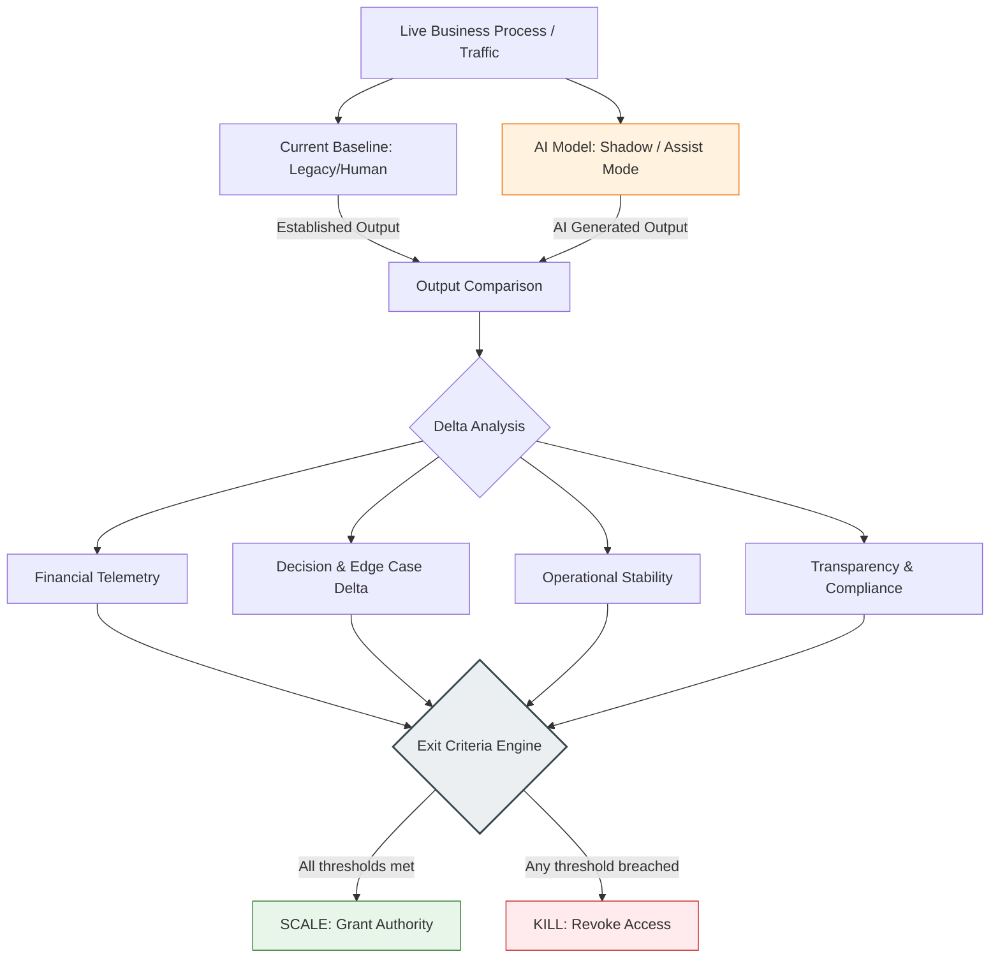

# MVP Exit Criteria & Validation Protocol

> **The Core Thesis:** An **AI MVP** is a **Decision-Centric Trust Contract**, not a technical sandbox for accuracy metrics. Its purpose is to quantify the "Delta of Disagreement" in Shadow Mode, allowing the Risk Owner to formally underwrite residual AI risks and prove financial value before full production deployment. 

---

## 1. The Validation Architecture (Shadow Mode)

To convert statistical accuracy into institutional trust, the MVP must run in a constrained environment to measure the **Delta of Disagreement** against the established baseline (Legacy System or Human Expert).

---

## 2. The Governance Pillars (Telemetry Stack)

The MVP phase is a **Real-World Stress Test**. We shift from theoretical modeling to live validation. This telemetry stack is designed to prove one thing: does the AI system perform better and more efficiently than the current baseline? This data forms the **Audit Trail** required to justify full-scale investment or immediate termination.

|**Pillar**|**Metric Category**|**Key Performance Indicator (KPI)**|**Rationale**|
|---|---|---|---|
|**Financial**|**CAPEX**|**Total Implementation Cost**|Sunk costs: R&D, model training, and integration.|
|**Financial**|**OPEX**|**Run Cost per [Unit of Work]**|Ongoing costs: inference, infrastructure, and human-in-the-loop.|
|**Financial**|**Value Impact**|**Gross Financial Benefit**|Revenue gains, operational savings, and risk cost reduction.|
|**Financial**|**Net Value**|**$\Delta$ ROI over Payback Period**|The bottom line: (Value - OPEX) vs CAPEX over the target period.|
|**Decision Logic**|**Disagreement**|**Baseline Deviation Rate**|The raw % of cases where AI logic differs from the legacy baseline.|
|**Decision Logic**|**Alpha (Superiority)**|**Performance Win Rate**|Accuracy/Profitability edge in cases where AI and Baseline disagree.|
|**Decision Logic**|**Edge Cases**|**Out-of-Distribution Error Rate**|Model stability and safety on high-stakes, non-typical scenarios.|
|**Stability**|**Engineering**|**System Latency @ P99**|Ensuring the AI doesn't bottleneck the enterprise architecture.|
|**Stability**|**Reliability**|**Fallback Activation Rate**|Frequency of automatic reversion to legacy logic due to system errors.|
|**Transparency**|**Compliance**|**Traceability Index**|Ability to provide audit-ready evidence for every AI decision.|
|**Transparency**|**Legal**|**EU AI Act Alignment**|Readiness of explainability reports for high-risk use cases.|

---

## 3. The Exit Criteria (The "Dead Man's Switch")

This protocol operates on a **Default-Dead** principle. To exit the pilot phase, the system must meet ALL predefined thresholds. Failure triggers an immediate halt.

|**Validation Domain**|**Agnostic Success Metric**|**Kill Threshold (VETO)**|
|---|---|---|
|**Financial Viability**|**Positive Net Value** over Payback Period|Total OPEX + CAPEX exceeds Gross Benefit.|
|**Decision Integrity**|**Positive Alpha** (Win Rate vs Baseline)|AI Win Rate < Baseline or Edge Case Error > Limit.|
|**Operational Stability**|**SLA Compliance** (Latency & Reliability)|P99 Latency > Threshold or Fallback Rate > [X]%.|
|**Trust & Compliance**|**Audit Readiness** (Traceability Index)|Missing logic/evidence for any high-risk AI decision.|

---

## 4. Governance Enforcement & Validation Window

The transition from MVP to Production is strictly controlled by a fixed **Validation Window** (e.g., 14 days) following the initial tuning phase.

> **The All-or-Nothing Rule:** To qualify for production, the system must meet the success thresholds for ALL 4 Governance Pillars during the final validation assessment.
> 
> * **Pass:** Telemetry reports are packaged into a **Risk Underwriting Dossier** for formal sign-off by the Business Risk Owner.
> * **Fail:** If a single threshold is breached by the end of the window, the project is terminated immediately. This prevents "Eternal MVPs" and budget leakage.
> * **No automatic pivot:** A failed validation phase cannot be extended. Any major adjustment is treated as a separate project iteration, requiring its own budget approval from the Business Risk Owner.