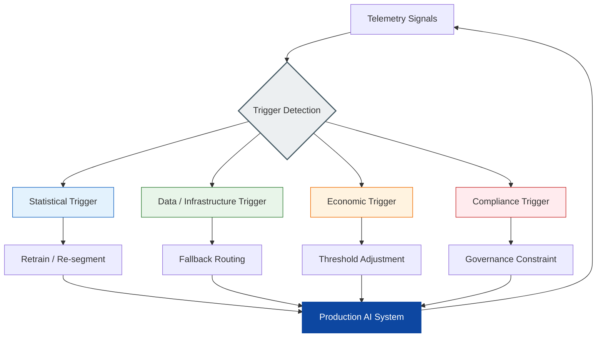

# Day-2 AI Operations & Governance Protocol

> **Core Thesis:**  
> An AI system does not enter production as a stable asset.  
> It enters production as a continuously degrading decision system operating under uncertainty.
>
> The real failure is not that the model makes mistakes.  
> The real failure is that the organization cannot react fast enough.

---

# 1. The Project Ends. The System Begins.

There is no final deployment state for enterprise AI.

The project phase ends when the organization transitions from:
- building a model,
- validating a pilot,
- integrating a workflow,

to operating a live decision system with direct business exposure.

From this point forward:
- data evolves,
- behavior drifts,
- economics change,
- constraints move,
- thresholds lose relevance.

AI production systems exist in permanent adaptation.

---

# 2. The Hybrid Control Surface

A production AI system is not governed by a single team.

It operates as a hybrid entity where multiple control functions continuously interact.

| Role | Operational Ownership |
|---|---|
| Business Owner | Risk appetite, thresholds, veto authority, residual risk |
| Data Science | Model quality, drift detection, validation, retraining |
| MLOps / Data Engineering | Pipelines, feature integrity, routing, fallback execution |
| Risk & Compliance | Policies, governance constraints, regulated go/no-go |
| AI Value Architect | Economics, operating logic, architecture and control alignment |

This control surface exists to maintain operational continuity under degradation.

---

# 3. The No-Pause Constraint

Enterprise AI systems operate under continuous business pressure.

Large-scale pauses are economically disruptive:
- throughput stops,
- manual review costs surge,
- latency increases,
- business value collapses.

As a result, governance must operate in motion. 
The "No-Pause" constraint dictates that governance must be proactive and embedded. The system does not stop to "think" or "report"; it evaluates triggers in real-time.

The objective is not permanent uptime at all costs.

The objective is controlled degradation:
- deterministic fallback,
- constrained automation,
- temporary human review,
- traffic re-routing,
- threshold tightening.

If a Kill Switch is triggered, the business process continues via Fallback, while the AI logic is terminated to prevent further loss.
The system must remain governable while continuing to operate.

**The Fallback Capacity Risk:**
Fallback capacity is an economic decision, not a technical absolute. If deterministic fallback paths or manual review cannot handle the AI's peak operational throughput, the resulting "capacity gap" must be explicitly quantified as a residual risk. The organization must pre-define an overflow strategy:
- traffic shedding (dropping non-critical requests),
- priority routing (fallback only for high-value segments),
- or asynchronous queueing.
Fallback logic must include a throughput triage mechanism to prevent the core business process from collapsing under sudden load.
---

# 4. Governance SLA for Degradation

A production AI system is not handed over as a model.

It is handed over as a Governance SLA defining how degradation is controlled.

| Control Layer           | Required Governance Capability                          |
| ----------------------- | ------------------------------------------------------- |
| KPI Framework           | Value metrics, baseline comparison, strategic alignment |
| Decision Thresholds     | Automation, review, fallback boundaries                 |
| Fallback Logic          | **Deterministic** safe degradation and routing paths    |
| Data & Model Monitoring | Input integrity, drift, feature consistency             |
| Compliance Constraints  | Explainability, fairness, audit readiness               |
| Roles & Decision Rights | Retraining, shutdown, override authority                |
| Economic Ownership      | P&L impact and residual risk accountability             |
| Observability Budget    | Governance logic must fit into the system's P99 Latency |

The purpose of telemetry is not observation.

The purpose is actionable intervention within the same operational cycle.

---

# 5. Pre-Start KPI Anchors

Before Day-2 operations begin, the organization must define what success means at two distinct levels: Strategic Intent and Operational Calibration. 

The system must be anchored to the original business initiative while utilizing detailed thresholds derived during the MVP-validation phase.

| KPI Domain              | Strategic Anchor (The "Why")                                                                             | Operational Calibration (The "How")                                                                         |
| ----------------------- | -------------------------------------------------------------------------------------------------------- | ----------------------------------------------------------------------------------------------------------- |
| **Value KPIs**          | Does the system achieve the business impact (P&L, Efficiency) defined at the initiative selection stage? | Is the system meeting the specific Net Value and Payback targets approved in the Risk Underwriting Dossier? |
| **Baseline Comparison** | Does the AI solution remain strategically superior to the deterministic or human baseline?               | Does the system maintain the specific Performance Alpha (Win Rate) validated during the MVP exit?           |
| **Strategic Alignment** | Does the system's current behavior still support the core business objective and risk appetite?          | Are operational deviations (Drift) within the permitted deltas established during the validation window?    |

Without this dual foundation, telemetry becomes noise without operational meaning, and the system loses its connection to the business value it was built to create.

---

# 6. Trigger System

AI systems degrade through different mechanisms.

Each degradation type requires a different operational response. To ensure time-to-action, the protocol explicitly separates automated (millisecond-scale) and manual (human-in-the-loop) reactions.

| Trigger Type                   | Signal                                                             | Response Type          | Primary Operational Response                                                                                                                  |
| ------------------------------ | ------------------------------------------------------------------ | ---------------------- | --------------------------------------------------------------------------------------------------------------------------------------------- |
| Physical & Data Trigger        | Missing data, API failure, schema drift                            | **Automated**          | Immediate routing to deterministic fallback.                                                                                                  |
| Statistical Trigger            | Concept drift, variance shift, metric decay                        | **Automated**          | Threshold Throttling: Downgrade affected segments from "Auto-Execute" to "Recommend" (Human-in-the-Loop) or narrow the automation boundaries. |
| Economic Trigger               | Margin compression, loss increase, cost-per-decision deterioration | **Manual**             | Threshold adjustment and automation restriction (Business Owner).                                                                             |
| Compliance & Strategic Trigger | Regulatory change, bias constraints, severe safety violation       | **Automated / Manual** | **Immediate Model Kill Switch** (100% traffic routed to Deterministic Baseline), followed by constraint reframing.                            |

---

# 7. Dynamic Equilibrium

Production AI systems are not stable.

They are continuously balanced under changing conditions.

Governance maintains equilibrium by interpreting signals in combination:

- data degradation → fallback + repair;
- model degradation → retrain or redesign;
- economic deterioration → threshold adjustment;
- compliance shift → governance constraint update.

The objective is continuity with controlled risk exposure.

---

# 8. Recursive Regression Loop

Not all failures can be resolved locally.

When local optimization fails, the organization must move backwards through the AI lifecycle without stopping operations.

| Failure Type | Required Regression |
|---|---|
| Economic Failure | Revisit value assumptions and operating economics |
| Infrastructure Failure | Revisit architecture and operational dependencies |
| Model Failure | Revisit assumptions, segmentation, observability |
| Regulatory Failure | Revisit governance and compliance design |
**The Re-entry Protocol:**
After a Kill Switch event, the system cannot be "hot-started" directly back into production. The updated logic must pass a mandatory validation phase (e.g., Shadow Mode) to confirm the resolution before regaining access to live business traffic and P&L.

This is structured regression under operational load.

---

# 9. Final Operating Rule

AI systems are never “finished”.

They survive only while the organization can:
- detect degradation,
- interpret signals,
- adapt thresholds,
- preserve governance,
- and maintain economic value under changing conditions.

The objective is not technical perfection.

The objective is long-term controllable value generation under uncertainty.
